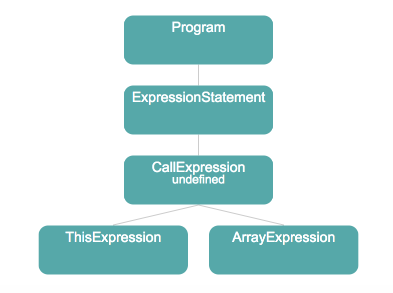
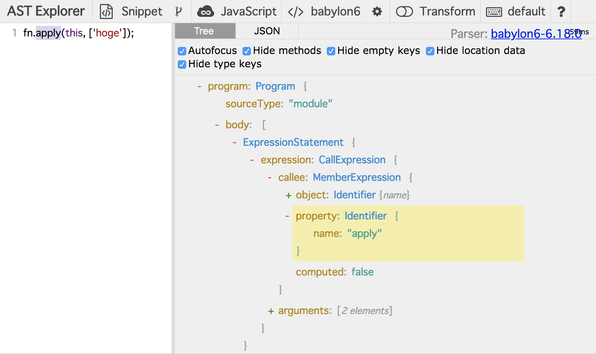
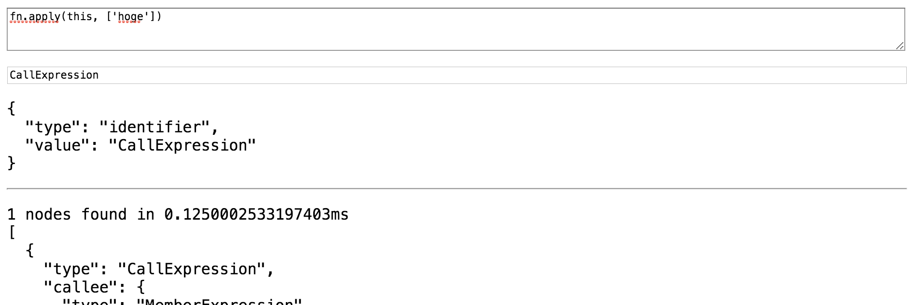

# Dive into AST

私達はすでに ESLint ルールモジュールの書き方を学びました。
この章では、ESLint と AST（抽象構文木）解析の関係を学びましょう。
禁止したいコードのパーツを見つける方法を学ぶ、と言い換えてもよいでしょう！

## お題

本章のゴールは、 関数の `apply` を呼び出しているソースコードを見つけるルールの作成です。
例えば:

```js
const fn = x => console.log(x);
fn.apply(this, ["hoge"]); // We want to ban it!
```

TDD の手法を使ってみましょう。

まず、このルールのテストコードを書きます。
`src/rules/no-function-apply.test.ts` という名前で新しいテストファイルを作成し、次のように編集してください:

```ts
import { RuleTester } from "eslint";

import rule from "./no-function-apply";

const tester = new RuleTester({ parserOptions: { ecmaVersion: 2015 } });

tester.run("no-function-apply", rule, {
  valid: [{ code: `fn('hoge')` }],
  invalid: [
    {
      code: `fn.apply(this, ['hoge'])`,
      errors: [{ message: "Don't use 'apply'" }],
    },
  ],
});
```

対応するルールモジュールも作成します。

```ts
/* src/rules/no-function-apply.ts */

import { Rule } from "eslint";

const rule: Rule.RuleModule = {
  create: context => {
    return {
      // To be implemented later
    };
  },
};

export = rule;
```

上記のルールはまだ空であり、どのようなコードが与えられても何も起きません。
したがって、 `npm test` は必ず失敗します。

## AST の可視化

ルールのコーディングをおこなう前に、私達が探し出して禁止したいソースコードのパターンについて考えてみてください。

JavaScript プログラムコードは ESLint の世界では AST として認識されています。
ですので、「ソースコードのパターン」は「AST のパターン」と言い換えられます。

そこで、今回のルールの禁止コードである `fn.apply(this, ['hoge'])`について、AST の形を明らかにしていきましょう。

次の図は対応する AST を可視化したものです。



AST は木構造のデータ表現です。
ソースコードの AST 検証には https://astexplorer.net を使うことができます。



https://astexplorer.net/#/gist/76acd406762b142f796a290efaba423e/f721eb98505736ec48892ab556517e30d2a24066

## ESLint における AST

ESLint のパーサー（例: acorn, esprima, babylon, typescript-eslint-parser など）は JavaScript プログラムを構文木へパースします。
構文木の要素は「ノード」と呼ばれます。
ノードは次のインターフェイスで定義されます。

```ts
interface BaseNodeWithoutComments {
  // Every leaf interface that extends BaseNode must specify a type property.
  // The type property should be a string literal. For example, Identifier
  // has: `type: "Identifier"`
  type: string;
  loc?: SourceLocation | null;
  range?: [number, number];
}
```

先述のように、私達は `fn.apply(this, ['hoge'])` の AST オブジェクトを AST explorer によって知っており、この構文木が "ExpressionStatement" というオブジェクトを持っていることを見てきました。
そして、このノードの `type` は `"ExpressionStatement"` という文字列値となります。

さて、ESLint ルールに話を戻しましょう。

前章にて、次のようなシンプルなルールを書きました:

```ts
const rule: Rule.RuleModule = {
  create: context => {
    return {
      Literal: node => {
        // Do something
      },
    };
  },
};
```

`create` 関数は `Literal` という名前をキーに持つオブジェクトを返却しています。
"Literal" というキーはどこから来たのでしょう？
これはリテラルノードのタイプ名であり、ESLint はこの名前に反応してハンドラ関数を呼ぶのです。

「セレクタ」と呼ばれるより複雑なキーをこのオブジェクトの中で利用可能です。
セレクタは HTML における CSS クエリにとても似ています。

例えば、次のセレクタは関数呼び出しの中のリテラルノードを見つけます。

```text
"CallExpression Literal"
```

これは子孫クエリの例です。
セレクタ記法は、ほぼ CSS クエリと同様の記法です。
他にどのようなクエリ記法があるかを知りたい場合は、 https://github.com/estools/esquery を見てください。

## セレクタの作成

それでは、 `fn.apply(this, ['hoge'])` のような、apply 関数の呼び出しを見つけるセレクタクエリを作成しましょう。

これには esquery のデモアプリがとても便利です。

- http://estools.github.io/esquery/ を開く
- 一番上のテキストエリアに `fn.apply(this, ['hoge'])` と入力
- つづいてテキスト入力欄に `CallExpression` と入力



このツールは入力したクエリが入力のソースコードの AST にヒットするかどうかを教えてくれます。

いま、私達は `.apply` の呼び出しを探したいと考えており、これは以下のように分解できます:

- CallExpression ノード
- MemberExpression ノード
- "apply" という名前を持つ Identifier ノード

また、私達は AST explorer の結果によって `fn.apply(this, ['hoge'])` の AST 構造をすでに知っています。
これらを使って、どのようなクエリがマッチするか考えてみてください。

答えがわかりましたか？
次のクエリがヒットするでしょう。

```
CallExpression > MemberExpression > Identifier.property[name='apply']
```

"no-function-apply" ルールを完成させましょう。

```ts
/* src/rules/no-function-apply.ts */

import { Rule } from "eslint";
import { Node } from "estree";

const rule: Rule.RuleModule = {
  create: context => {
    return {
      "CallExpression > MemberExpression > Identifier.property[name='apply']": (node: Node) => {
        context.report({
          message: "Don't use 'apply'",
          node,
        });
      },
    };
  },
};

export = rule;
```

最後に、もう一度 `npm test` を実行してください。今度は成功するはずです :sunglasses:

## 付録: esquery の"field"記法

ところで、 `Identifier[name='apply']` ではなく、 `Identifier.property[name='apply']` というクエリを使っていたことに気づきましたか？
`.property` という部分は「フィールド」という esquery の文法です。
`Identifier.property` は「親要素における `property` フィールドとして位置している Identifier ノード」を意味しています。

なぜこの文法を使うのでしょう？
`Identifier[name='apply']` では不十分なのでしょうか？

答えは yes です。

`fn.apply` は MemberExpression ノードにパースされます。
このノードは 2 つの子ノードを持ち、この子ノードは両方ともに同じ "Identifier" タイプです。

```js
{
  type: "MemberExpression",
  object: {
    type: "Identifier",
    name: "fn"
  },
  property: {
    type: "Identifier",
    name: "apply"
  }
}
```

したがって、もし `Identifier[name='apply']` を使ってしまうと、正しいコードである `apply.hoge()` でもエラーが出力されてしまいます。

`Identifier.property` セレクタによって、2 番目の Identifier ノードをピックアップできたのです。

## Summary

- ESlint ルールにおけるオブジェクトキーには AST セレクタが利用可能
- https://astexplorer.net で AST の検証が可能
- http://estools.github.io/esquery でセレクタのチェックが可能

[Previous](../10_your_first_rule/README.ja.md)
[Next](../30_other_parsers/README.ja.md)
