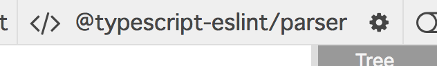

# Other parsers
もしかしたら、あなたのチームではTypeScriptのようなトランスパイラを利用しているかもしれません。
このような場合、作成したESLintルールは同じトランスパイラでテストされるべきです。

## 別のパーサーを追加する
この章を通して、 TypeScript / React JSX を扱えるようになりましょう。

```tsx
type Props = {
  onClick: () => void,
};
const MyComponent = ({ onClick }: Props) => (
  <button onClick={() => onClick()} />
);
```

そして、`<button />` というReactコンポーネントを禁止したいと思っている、とします。

まずはこれに対応するASTの構造を知るところからです。
覚えていますか？
そうです、私達には https://astexplorer.net があります。

TypeScript/JSXのパースを有効化するため、パーサー種別を "@typescript-eslint/parser" へ切り替えてください。



ちなみに、ESLintはデフォルトではesprimaというパーサーを使います。

`<button />` を見つけるクエリがわかりましたか？
はい、 `JSXIdentifier[name='button']` ですね。

ですので、今回のルールは次のような実装となります:

```ts
/* src/rules/no-jsx-button.ts */

import { Rule } from "eslint";
import { Node } from "estree";

const rule: Rule.RuleModule = {
  create: (context) => {
    return {
      "JSXIdentifier[name='button']": (node: Node) => {
        context.report({
          message: "Don't use <button>",
          node,
        });
      },
    };
  },
};

export = rule;
```

## rule testerを設定する
上記のルールをテストするため、このプロジェクトにパーサーを追加します。

```sh
$ npm i @typescript-eslint/parser --dev
```

そして、ESLintのRuleTesterにパーサー設定をおこないます。

```ts
/* src/rules/no-jsx-button.test.ts */

import { RuleTester } from "eslint";

import rule from "./no-jsx-button";

// Specify parser
const tester = new RuleTester({
  parser: "@typescript-eslint/parser",
  parserOptions: {
    jsx: true,
  },
});

tester.run("no-jsx-button", rule, {
  valid: [
    {
      filename: "valid.tsx", // filename must be set to tell parser this code is tsx
      code: `(props: props) => <div />`,
    },
  ],
  invalid: [
    {
      filename: "invalid.tsx", // filename must be set to tell parser this code is tsx
      code: `(props: props) => <button />`,
      errors: [{ message: "don't use <button>" }],
    }
  ],
});
```

どのような `parserOptions` が利用できるかは、各パーサーが決定します。
たとえば、`@typescript-eslint/parser` の設定可能な値は https://github.com/eslint/typescript-eslint-parser に列挙されています。
また、 `parser` / `parserOptions` はチームのプロジェクトの .eslintrc ファイルにも存在しているはずです。

もしも RuleTesterのパーサー設定を忘れてしまった場合、 `npm test` にて次のようなパースエラーが出力されてしまいます。

```text
Message:
  Should have no errors but had 1: [ { ruleId: null,
    fatal: true,
    severity: 2,
    message: 'Parsing error: Unexpected token :',
    line: 1,
    column: 7 } ]
```

## Summary

* プロジェクトが利用しているのと同じパーサーを使ってルールをテストしましょう

[Previous](../20_dive_into_ast/README.ja.md)
